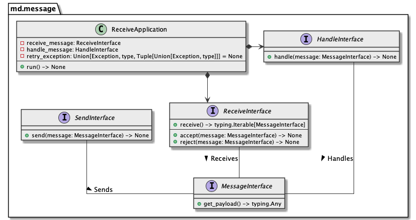

# md.message

md.message component defines message/message queue interaction contracts and  
provides few useful tools out from box.

## Architecture overview



## Installation

```sh
pip install md.message --index-url https://source.md.land/python/
```
