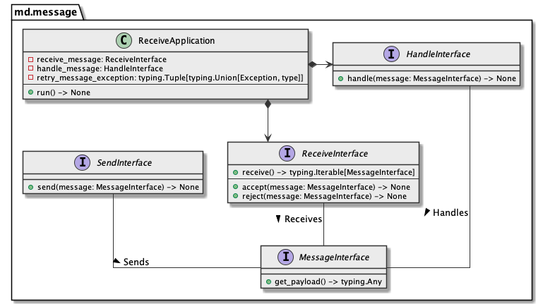

# md.message

md.message component defines message/message queue interaction contracts and 
provides few useful tools out from box.

## Architecture overview



## Installation

```sh
pip install md.message --index-url https://source.md.land/python/
```

## [Documentation](./docs/index.md)

Read documentation with examples: https://development.md.land/python/md.message/

## [Changelog](changelog.md)
## [License (MIT)](license.md)
